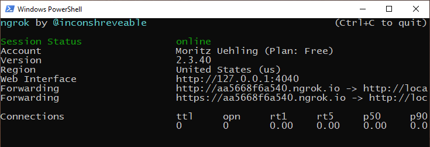
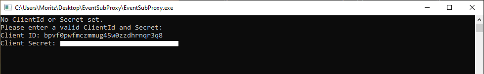
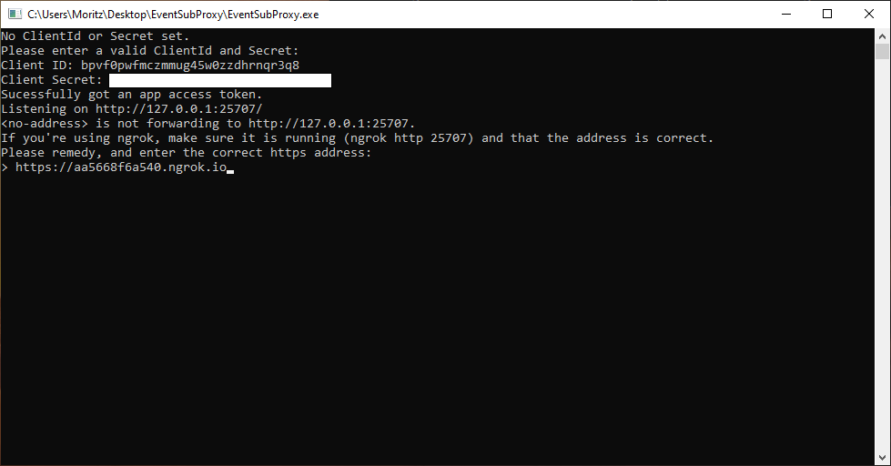
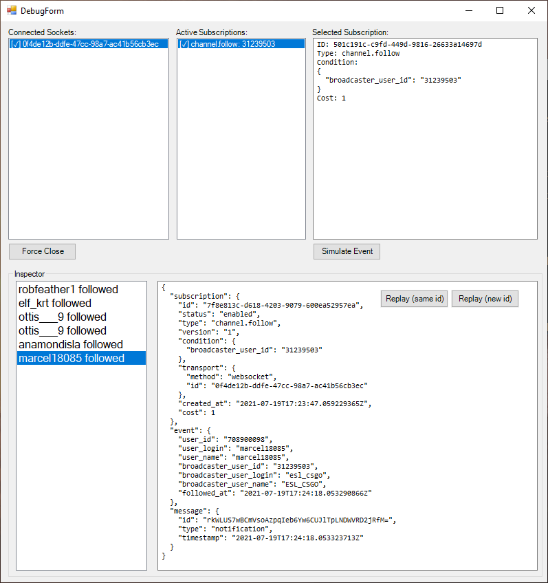

# EventSubProxy

[TOC]

## Why the EventSubProxy is needed

The Twitch Game Engine Plugins will rely on [EventSub WebSockets](https://discuss.dev.twitch.tv/t/rfc-0016-eventsub-websockets/32652) which are scheduled to launch later this year. The EventSub proxy is a small locally run tool that acts as a shim for this dependency, and will only be necessary during the beta testing period.

Once the full WebSocket EventSub implementation is released, the EventSubProxy will not be needed anymore. However, it will likely evolve during the beta - for example, to simulate additional events, like hype-trains. We will keep you up-to-date of any necessary changes through the beta mailing list.

## Setup

The Twitch servers need to be able to send the EventSubProxy https requests. For this, we recommend using a tool like [ngrok](https://ngrok.com/download), which you then can run with a simple `.\ngrok.exe http 25707` from PowerShell.

 

After this is set up, download and extract the `EventSubProxy.zip` archive. Then, start the `EventSubProxy.exe` file. You may get a Windows SmartScreen warning. Proceed.

The first time you launch it, it will ask you for a Twitch client id and secret. Acquire a client id and secret at [dev.twitch.tv](https://dev.twitch.tv/). You should use the same client id and secret for the engine plugin and the EventSubProxy.

After this, enter the `https`-address output by the still-running ngrok command.

After this, a window should open, and the EventSubProxy is running. Once you start using the engine plugins, you should see open connections and subscriptions. You can simulate and replay events using the window.

