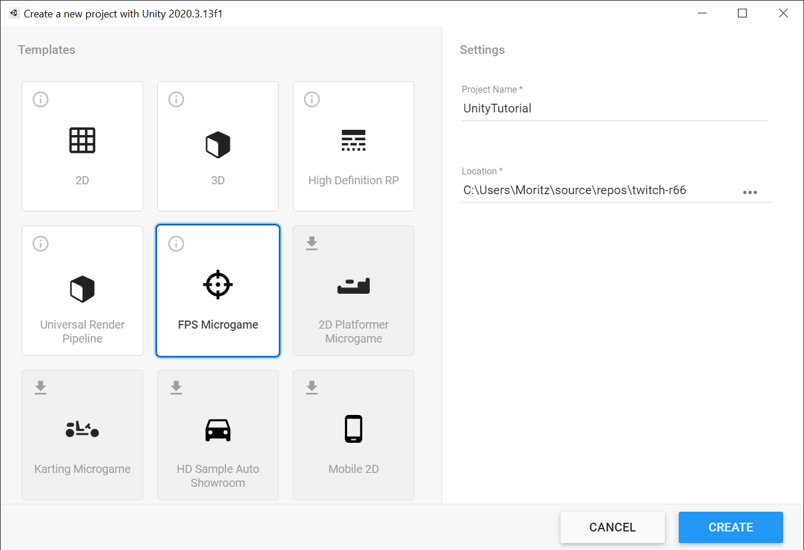
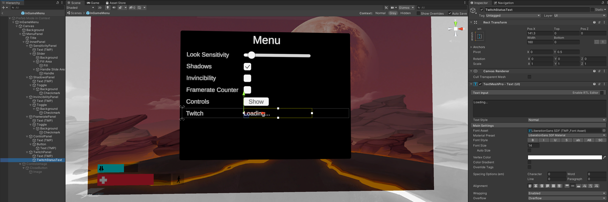
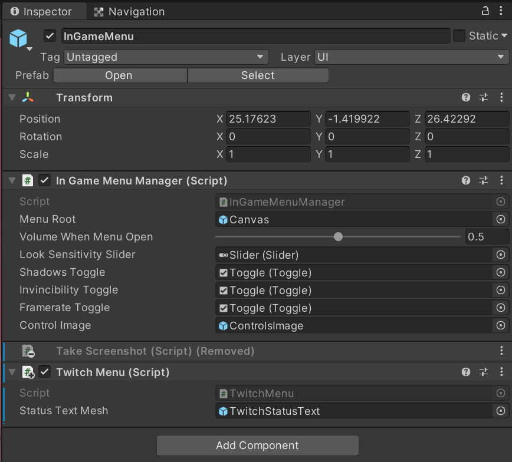
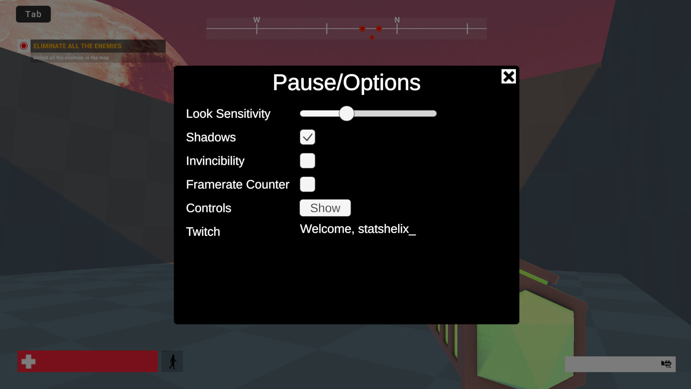
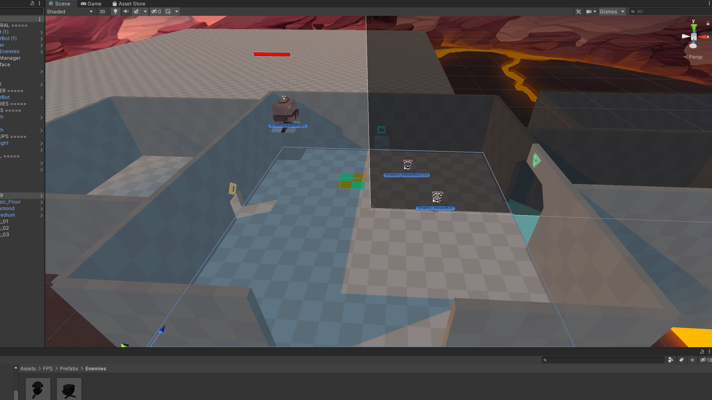
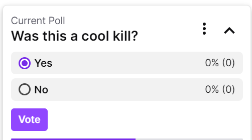

# Unity: An Example

[TOC]

In this tutorial, we'll show you how to use the SDK by modifying Unity's "FPS Microgame" template.

To demonstrate adding viewer interaction, we will start a poll once the player kills the first enemy. It will ask "Was this a good kill?". If the viewers don't agree that it was a good kill, we will spawn 5 more enemies around the player.




After this, we import the SDK, and set up a ClientId and Secret as described in the [Unity Setup](unity.md) documentation. We also create an Assembly definition for the `Plugins` folder, and reference it in the `FPS.UI` and `FPS.Gameplay` assemblies. 


## Authentication

First, we want to provide for streamers to easily log in and out. For this, we will add some options to the tab menu of the FPS example.

We remove the ScreenshotPanel from the Prefab, and add our own TwitchPanel to it. Our TwitchPanel simply has two TMP-Texts:



For this, we create a C# Script to control the authentication flow:

```csharp
using R66;
using R66.Interop;
using TMPro;
using UnityEngine;

public class TwitchMenu : MonoBehaviour
{
    [Tooltip("Where to display the status text")]
    public GameObject StatusTextMesh;

    private TextMeshProUGUI StatusTextElement;

    TwitchOAuthScope[] RequiredScopes = new TwitchOAuthScope[] { TwitchOAuthScope.Channel.ManagePolls };

    void Start()
    {
        StatusTextElement = StatusTextMesh.GetComponent<TextMeshProUGUI>();
    }

    void Update()
    {
        if (Twitch.API == null || StatusTextElement == null)
            return;

        var status = Twitch.API.GetAuthState().MaybeResult?.Status ?? AuthStatus.Loading;

        if (status == AuthStatus.Loading)
        {
            StatusTextElement.text = "Loading...";
        }
        else if (status == AuthStatus.LoggedOut)
        {
            // It is okay to call this multiple times, we only send the request once.
            Twitch.API.GetAuthenticationInfo(RequiredScopes);
            StatusTextElement.text = "Loading...";
        }
        else if (status == AuthStatus.WaitingForCode)
        {
            var ai = Twitch.API.GetAuthenticationInfo(RequiredScopes).MaybeResult;
            if (ai == null)
            {
                StatusTextElement.text = "Loading..."; ;
                return;
            }

            StatusTextElement.text = $"Enter {ai.UserCode} at the link \n{ai.Uri}";
        }
        else if (status == AuthStatus.LoggedIn)
        {
            // It is also completely fine to call GetMyUserInfo once per frame,
            // this value is cached by the API, so we do not need to remember anything!
            var user = Twitch.API.GetMyUserInfo().MaybeResult;
            if (user == null)
                return;

            StatusTextElement.text = $"Welcome, {user.LoginName}";
        }
    }
}
```

And we add this script to the InGameManager, and make sure to assign the `StatusTextMesh` in the Unity Editor.



And with this, players can simply log in by following the instructions in the menu:




## Gameplay - Creating the Poll, spawing the enemies

To control the Gameplay, we will create a TwitchPollManager script, which we attach to a GameObject. This will listen to `EnemyKilled` event, and once it occurs, it will create the poll, and, based on the results, spawn the enemies.

To make sure the user doesn't finish the game before the poll is finished, we add in a couple of enemies by simply dragging in some enemy prefabs into the scene. 



In our TwitchPollManager, we subscribe to EnemyKilled, and create a poll there. We also make sure to cancel our poll if (for example) the Scene gets reloaded (because the player restarted)

```csharp
using R66;
using R66.Interop;
using System.Linq;
using Unity.FPS.Game;
using UnityEngine;

public class TwitchPollManager : MonoBehaviour
{
    GameTask<Poll> ActivePoll = null;

    // Start is called before the first frame update
    void Start()
    {
        EventManager.AddListener<EnemyKillEvent>(OnKill);
    }

    void OnKill(EnemyKillEvent kill)
    {
        // We already polled something, so we don't do anything.
        if (ActivePoll != null)
            return;

        var authStatus = Twitch.API?.GetAuthState().MaybeResult;
        if (authStatus?.Status != AuthStatus.LoggedIn)
            return;

        // If we don't have the "Manage Polls" permission, we also give up. 
        // This isn't needed for this demo, as we will always have it, but it's
        // best practice to guard against this either way.
        if (!authStatus.Scopes.Any(a => a == R66.TwitchOAuthScope.Channel.ManagePolls.Scope))
            return;

        ActivePoll = Twitch.API.NewPoll(new PollDefinition
        {
            Title = "Was this a cool kill?",
            Choices = new string[] { "Yes", "No" },
            Duration = 20, // We can't take too long here, or the user will finish the level!
        });
    }

    private void OnDestroy()
    {
        // We should clean up. For example, if the user dies, we cancel the poll.
        if (ActivePoll == null)
            return;

        // We do this in a ContinueWith, to make sure it always gets executed.
        // For example, if you kill your first enemy and die right after,
        // the poll request might not have a response yet. 
        // So we need for it to be fully created before we can cancel it.
        ActivePoll.Task.ContinueWith((task) =>
        {
            // This happens if creating the poll failed, for example
            if (ActivePoll.MaybeResult == null)
                return;

            // Check if the poll already ended, and if not, cancel it.
            if (!ActivePoll.MaybeResult.PollEnded.IsCompleted)
                ActivePoll.MaybeResult.DeletePoll();
        });
    }

    // Update is called once per frame
    void Update()
    {
        
    }
}
```

If en enemy is killed, a poll will start in chat!



Now, we just need to react to the poll being finished, and we're done! For this, we create a varible that remembers if enemies were already spawned, and we add a parameter to our script of the prefab we want to spawn.

```

    [Tooltip("Which enemy should be spawned if the player loses the poll.")]
    public GameObject EnemyToSpawn;

    private bool PollHasEnded = false;
```


Then, we write an `Update` method that checks if the poll finished, and if yes, checks the results - if the player was not sucessful in entertaining their viewers, we punish him!


```csharp
    void Update()
    {
        if (PollHasEnded)
            return;

        var poll = ActivePoll?.MaybeResult;
        if (poll == null)
            return;

        // This means we have an active poll, and are waiting for it to finish.
        if (poll.Info.Status == PollStatus.Active)
            return;

        // Now we know the poll is finished in some way.
        PollHasEnded = true;

        // This poll was cancelled by someone, so we don't take the results.
        if (ActivePoll.MaybeResult.Info.Status != PollStatus.Completed)
            return;

        // But now, we finally have the results :)
        var yesVotes = poll.Info.Choices.Where(a => a.Title == "Yes").Single();
        var noVotes = poll.Info.Choices.Where(a => a.Title == "No").Single();

        if (noVotes.Votes > yesVotes.Votes)
        {
            // uh-oh, player has lost.
            var me = GameObject.Find("Player");

            var pos = me.transform.position;
            var direction = me.transform.forward.normalized;
            var up = me.transform.up.normalized;

            for (int i = 0; i < 3; i++)
            {
                // Let's spawn the enemies right in front of his face!
                var playerPos = pos + direction * 3f * (i + 5);

                // Let's give him a couple more enemies to fight!
                Instantiate(this.EnemyToSpawn, playerPos, Quaternion.identity);
            }

        }
    }
  ```

And there we go, if the viewers are not entertained, the game makes sure they will be!

Of course, at this is far from perfect at the moment. For example, if the player looks into the floor when the poll ends, the hoverbots will spawn below the floor, and are thus unkillable. 

However, this should give you some great insight and ideas into how you can use the Twitch Platform to create amazing experiences - for both your players and viewers of your game.


